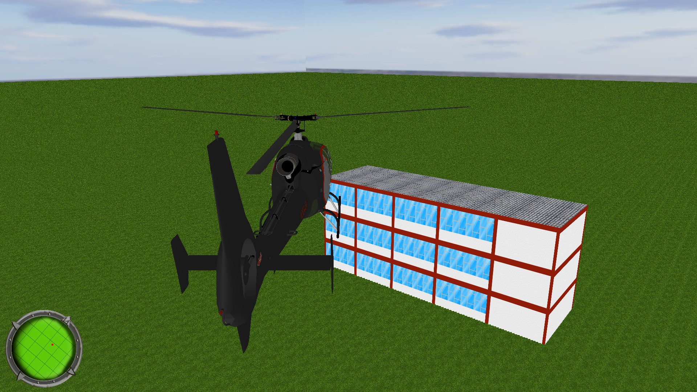
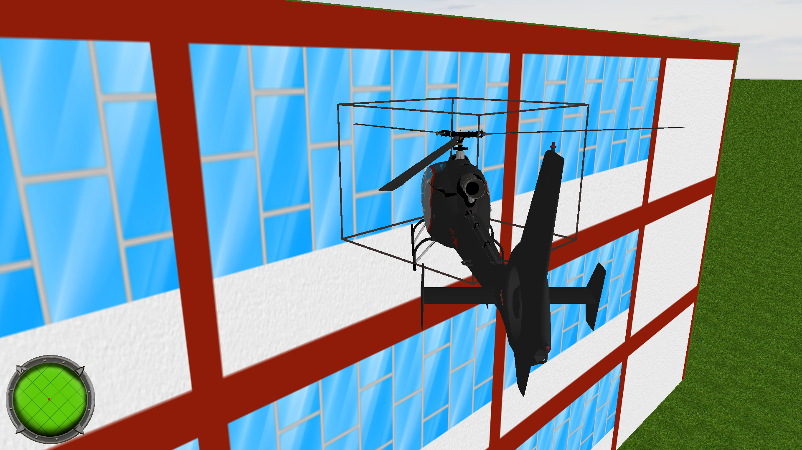
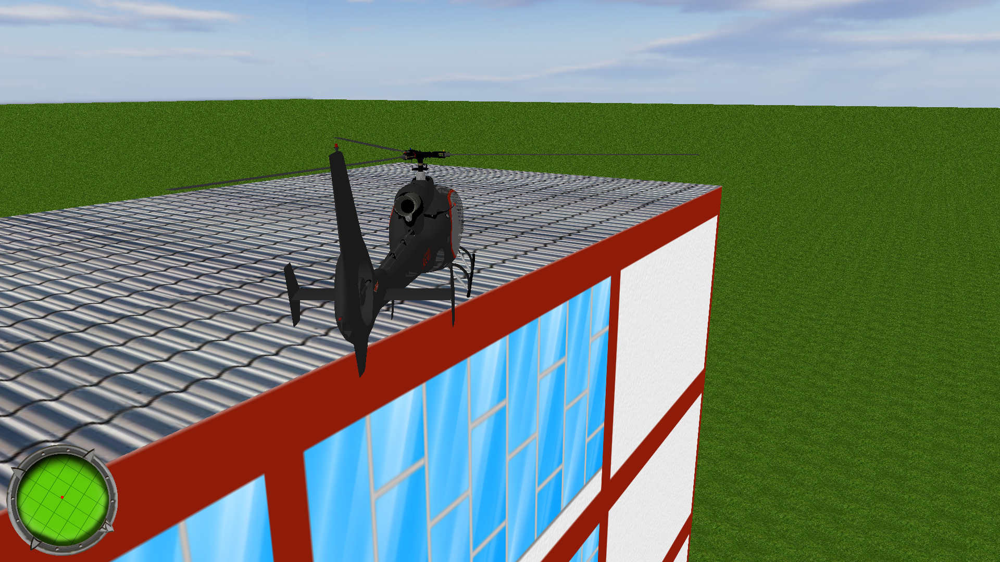

# Simulador de Helicóptero

Este é um software desenvolvido para a disciplina de Computação Gráfica da Universidade Federal de Ouro Preto.

O software foi escrito utilizando C# como linguagem de programação. Para desenhar os gráficos foi utilizado o OpenTK, uma versão da biblioteca gráfica **OpenGL** para o dotnet.

### Controle usando teclado ou o joystick do XBox
Como forma de melhorar a experiência do usuário, é possível utilizar tanto o teclado como o joystick do xbox para controlar o helicóptero. O controle do xbox permite utilizar seu gatilho para manter um controle mais preciso sobre a operação do helicóptero do que no teclado do computador. Não é necessário nenhuma configuração ou driver adicional. Todos os drivers dos controles xbox são plug-and-play.

### Sistema de Colisão de Objetos

Uma vez que este projeto não utiliza nenhum tipo de engine gráfica, toda a parte de colisão entre objetos foi escrita manualmente através da técnica de *bounding box*, ou simplesmente, caixa envolvente. Os objetos da cena são contidos dentro de cubos onde as colisões são tratadas mais facilmente.

### Usando o controlador MIDI do Windows para efeitos
O Windows possui nativamente um sintetizador de instrumentos musicais. Podemos ouvir este sintetizador em funcionamento quando tocamos arquivos .midi no Windows Media Player.

O sintetizador do Windows possui mais de 100 instrumentos e sons, sendo um deles, o som das hélices de um helicóptero em funcionamento.

O sintetizador está disponível para uso através da api do Windows. Para utilizá-lo precisamos importar a dll **winmm.dll** diretamente para nosso projeto e reescrever suas funções através de chamadas **PInvoke**.

### Sistema de bússola
Em complemento à experiência do usuário, uma bússola foi adicionada para indiciar o posicionamento do helicóptero em relação ao centro da cena.
